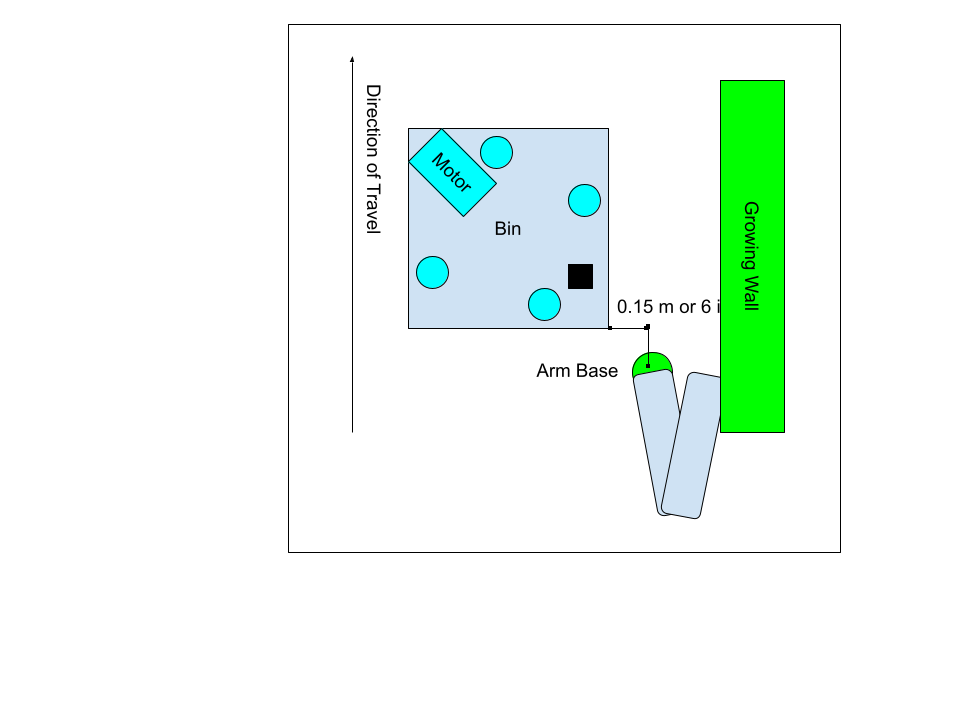
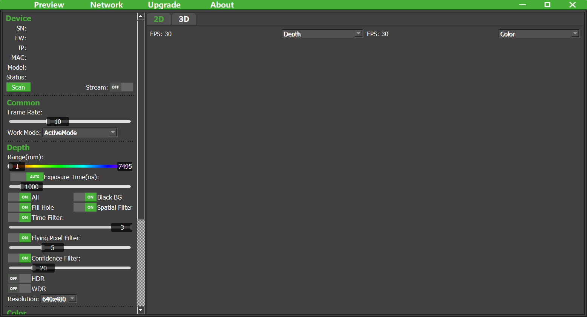
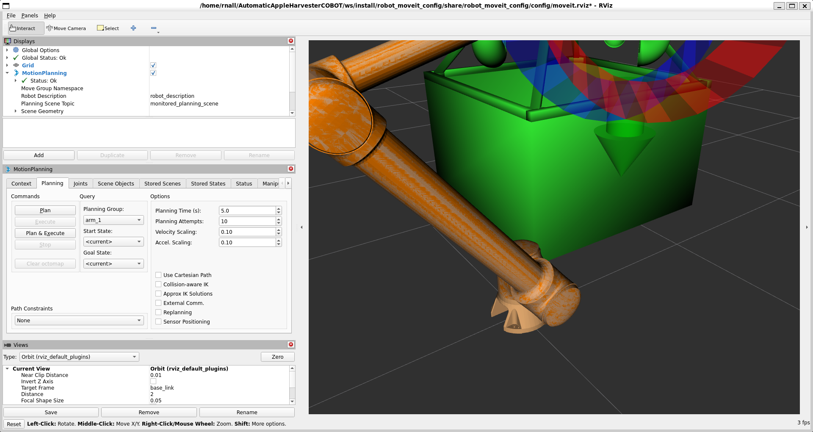
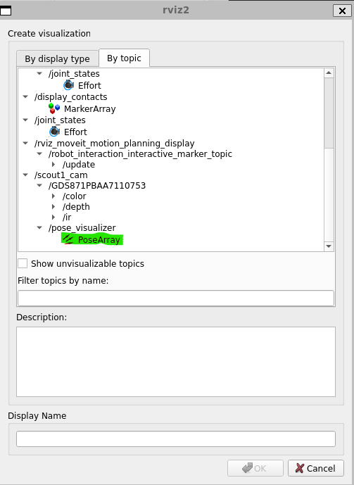
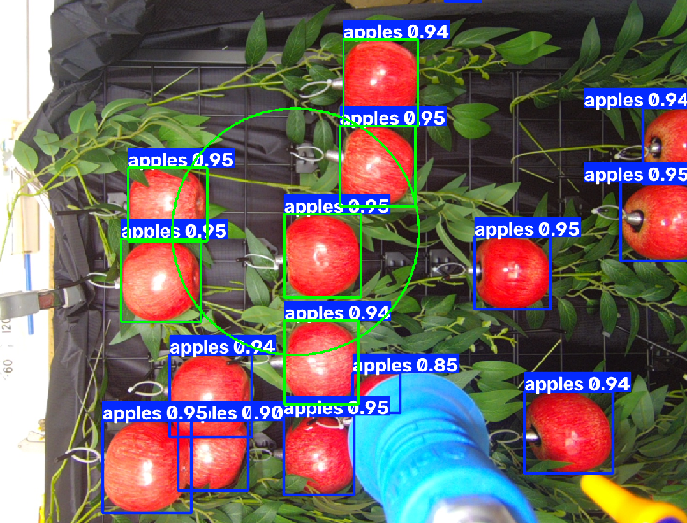
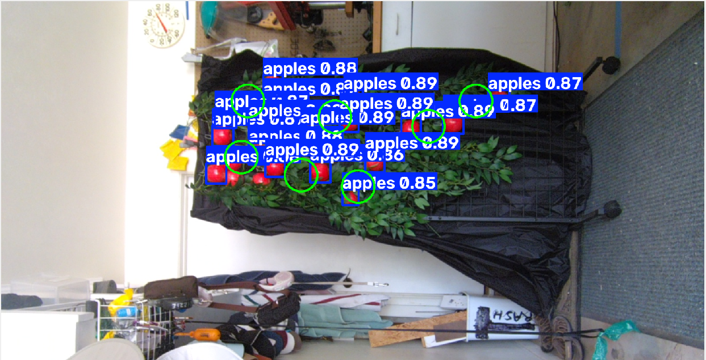
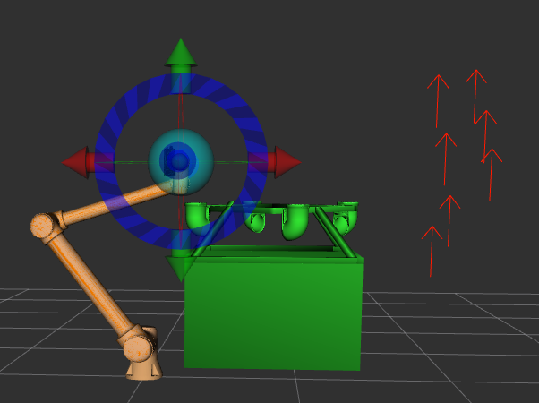

## Startup Procedure
### Initial Setup
These steps are not necessarily in order, so long as they are all completed
* Set up the ESP32 following the diagram below.
* Connect the J2 control box to the robot using the CAN bus cable.
* Connect the teach pendant to the J2 control box.
* Connect the J2 control box (LAN 1 port), cameras, and the laptop to the POE ethernet switch. The order does not matter
* Plug in the ethernet power switch to 120V power.
* See below for verifying the cameras are connected and working.
* Plug in the J2 control box to 220V power.
* Turn on the power switch on the J2 control box.
* Press and hold the power button on the teach pendant.
* Once the teach pendant is active, click the second symbol on the left hand side menu, beneath the robotic arm. Go to Net. Verify you are connected to LAN1. Select the `Static IP` option, and set the IP to `192.168.1.10` and the Subnet Mask to `255.255.0.0`. Select `Confirm`.
* To verify the connection between the robot and the laptop run `ping 192.168.1.10`
* Connect the USB cable between the ESP32 and the laptop. The port does not matter.
* Plug in the load resistor to 120V power. The spotlight on the arm should turn on.
* Connect the air compressor to 120V and turn it on.
* Make sure that the IP address on your laptop's ethernet port is set to `192.168.1.xxx`. In our system we used `99`.
### ESP32 wiring diagram


### Robot and bin layout
**THIS MUST BE FOLLOWED**



### Verify the Cameras
This is not necessarily required, but it can be useful.
* Begin by opening the ScepterGUI Tool. This tool can be found here: https://github.com/ScepterSW/ScepterGUITool



* From this screen, select the `Scan` button.
* You should get a screen which lists all the connected Scepter cameras. If you do not see your cameras, they are not connected correctly. Verify that your laptop's network adapter has been set to `192.168.1.xxx` and that the cameras are plugged into the ethernet POE switch, and verify the cable run is connected the whole way. You may need to disable the firewall. 
* Once the camera is connected from the scan screen, select the `Stream` toggle switch to see a live feed from the camera.
* Go to the `Network` tab from the list along the top of the window.
* Verify the `Arm Camera` has an IP address of `192.168.1.101` and a Subnet mask of `255.255.255.0`.
* Verify the `Scout Camera` has an IP address of `192.168.1.201` and a Subnet mask of `255.255.255.0`.

### Starting the Demo
To start the demo, do these steps in this order (Windows).
* Firstly, set the mode on the teach pendant to Manual and the speed to 50%. If you want to move the arm faster, set the mode to Automatic and the speed to 100%. These settings can be found at the top right of the teach pendant screen.
* Open the Executables folder.
* Run `Initialize System.bat`.
* At this point you may run `Suction Test.bat`, which just verifies the suction system is working.
* This step may fail. Below are debugging steps.
  * `No CP210x USB device is currently connected.`: Make sure the USB cable is connected to the ESP32.
  * `Failed to attach USB device.`: Unplug the USB cable and plug it back in.
  * Holding at `[Launch] Waiting for robot at 192.168.1.10...`: Verify your network setup is correct and that the arm is on.
  * Watch the terminal for this log statement:
    ```   
    [suction_commander-7] Failed to open serial port: No such file or directory
    [suction_commander-7] [WARN] [1787764825.897966833] [suction_commander]: Unable to open serial port!
    ``` 
    It means that something has failed in initialization and the system needs restarted. When you restart, reseat the USB device before running the executable.
  * Watch the terminal for log statements like this from any camera:
    ```
    [component_container-3] [INFO] [1787699358.211737362] [arm1_cam]: scGetFrameReady failed! -23
    ```
    This is a stale camera error. We don't know what causes it, but to fix it you have to restart the system
* Wait for the arm to entirely activate. It will make noise, and a chattering sound.
* You may see log statements like these:
```
[scout_camera_scanner-6] [WARN] [1787765171.013004085] [scout_camera]: Move forward by one pane!
[robot_state_publisher-8] [WARN] [1787765166.711975152] [robot_state_publisher]: Moved backwards in time, re-publishing joint transforms!
```
You may safely ignore these.
* Run the `Do QR Scan.bat` executable. THIS WILL MOVE THE ARM. Pay attention to where the arm ends up after the second movement, it should be directly over the chute.
* IF the arm successfully found the chute, you may run `Scan In Place.bat` to scan the apples the arm can currently see, which you can find on the Camera View window. 
* This step may fail with `[ERROR] [1787765587.115700842] [qr_check_node]: QR check failed: no /qr_valid state received.`. IF you have ran `Do QR Scan.bat` after running `Initialize System.bat`, you may safely rerun this code and it should work. This issue is because the computer's CPU is struggling to keep up with the processes running.
* If you want to move the arm, you may either use the buttons on the teach pad while in Manual mode, or run `Start RViz.bat` to move the arm.
* To see the results of the scout camera, follow the above instruction to run RViz.



* From this screen, select `Add` in the top left display. This will open a new window. In this window, select `By Topic` and look for `/pose_visualizer`, where you'll see `PoseArray` beneath it. Double click on `Pose Array`. This will add the scan poses to the 3D view based on where the scout camera thinks the arm needs to move to to scan the entire wall. 



* From the `Initialize System.bat` terminal, you can use the up and down arrow keys to simulate the robot moving.
* Run the `Move To ScanPose.bat` executable to move the arm to one of these scan poses, if it can reach.
* Running `Pick In Place.bat` after this emulates the intended system behaviour.

## Results

<p align="center">
  <video src="./images/PickAndPlace.mp4" controls width="800">
    Your browser does not support the video tag.
  </video>
</p>



This is the results from our computer vision system, where it identified the apples. This system is run through Oregon State's models, which can be found here: https://github.com/eugeneyjy/apple-3d-localization



This is the results from the scout camera, which runs the same model, and takes a least covering circle algorithm to determine the scan poses based on the Arm camera's scan radius.



This is these poses projected into the Arm's xy plane.
